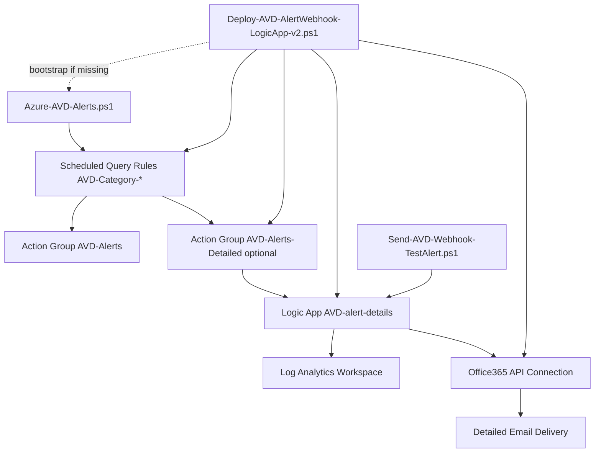
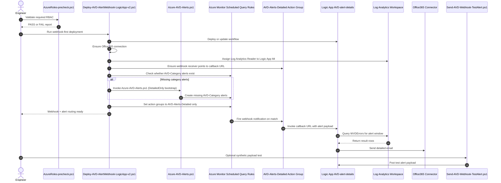

# AVD Alerts Scripts Guide

**Last Updated:** March 2026

This folder contains production-focused PowerShell scripts for deploying and maintaining Azure Virtual Desktop (AVD) alerting.

These scripts are designed to *complement Azure Virtual Desktop Insights* by adding proactive, category-based alerting from Log Analytics data.

## Scripts In Scope

1. `Azure-AVD-Alerts.ps1`
Creates and maintains core `AVD-Category-*` scheduled query alerts and the primary email action group (`AVD-Alerts`).

2. `Deploy-AVD-AlertWebhook-LogicApp-v2.ps1`
Deploys/updates the detailed email Logic App (`AVD-alert-details`), ensures Office365 API connection exists, assigns Log Analytics Reader to Logic App managed identity, ensures detailed webhook action group (`AVD-Alerts-Detailed`), and automatically switches existing `AVD-Category-*` scheduled query alerts to detailed-only action group routing.

3. `AzureRoles-precheck.ps1`
Validates required RBAC permissions for deploying and maintaining the alert stack.

4. `Send-AVD-Webhook-TestAlert.ps1`
Posts a synthetic Azure Monitor common alert payload to validate the detailed webhook flow end-to-end.

## Run Order

1. Use `AzureRoles-precheck.ps1` before deployment or role changes.
2. Preferred webhook-first path: run `Deploy-AVD-AlertWebhook-LogicApp-v2.ps1`.
3. The webhook script auto-creates missing `AVD-Category-*` alerts via `Azure-AVD-Alerts.ps1` (if needed), then switches routing to detailed-only.
4. Optional baseline-first path: run `Azure-AVD-Alerts.ps1` before webhook deployment.
5. Optionally run `Send-AVD-Webhook-TestAlert.ps1` to validate callback processing.

## Dependency Diagram



## Execution Sequence



## Prerequisites

- Azure CLI installed and authenticated (`az login`)
- Azure CLI `scheduled-query` extension available
- Target Log Analytics workspace receiving AVD diagnostics
- Required RBAC on target subscription/resource groups/workspace
- For webhook email delivery: authorize the Office 365 API connection (for example, `avd-alerts-office365`) in Azure Portal using valid mailbox credentials

## Minimum RBAC / Roles

| Script | Minimum RBAC / Role | Notes |
|---|---|---|
| `Azure-AVD-Alerts.ps1` | `Monitoring Contributor` on target resource group + workspace read access | Creates/updates scheduled query alerts and action groups. |
| `Deploy-AVD-AlertWebhook-LogicApp-v2.ps1` | `Contributor` on target resource group; ability to assign role at LAW scope when needed | Deploys Logic App, manages Office365 connection/action group, assigns `Log Analytics Reader` to Logic App MI. |
| `AzureRoles-precheck.ps1` | Read access to role assignments/role definitions in relevant scopes | Evaluates required Azure actions across scopes. |
| `Send-AVD-Webhook-TestAlert.ps1` | `Logic App Contributor` (or `Contributor`) on target resource group | Resolves callback URL and invokes test payload. |

## What Each Script Changes

| Script | Azure Resources Changed | External Calls | Local Files |
|---|---|---|---|
| `Azure-AVD-Alerts.ps1` | Creates/updates `AVD-Category-*` scheduled query rules, ensures `AVD-Alerts` (unless `-DetailedOnly`), ensures/uses `AVD-Alerts-Detailed` when configured | Azure control plane via `az` | Writes CSV report (`avd-alerts-report*.csv`) |
| `Deploy-AVD-AlertWebhook-LogicApp-v2.ps1` | Creates/updates Logic App `AVD-alert-details`, ensures `Microsoft.Web/connections` (Office365), ensures `AVD-Alerts-Detailed` receiver, assigns role to LAW MI, bootstraps missing `AVD-Category-*` alerts, and switches those alerts to detailed-only action group routing | Azure control plane; Logic App runtime calls Log Analytics and Office365 connector | Temporary deployment JSON in OS temp path (cleaned up) |
| `AzureRoles-precheck.ps1` | No persistent resource changes | Azure control plane reads role assignments/definitions | No local output by default |
| `Send-AVD-Webhook-TestAlert.ps1` | No persistent resource changes | Posts sample payload to Logic App callback URL | No persistent local output |

## Sample Usage

### Option 1) Rich Alerts via Webhook + Logic App (Webhook-First Single Script)

This command deploys/updates the Logic App webhook flow, auto-creates missing `AVD-Category-*` alerts when needed, and enforces detailed-only routing.

Steps:

1. Run `Deploy-AVD-AlertWebhook-LogicApp-v2.ps1`.
2. The script deploys webhook infrastructure, bootstraps missing `AVD-Category-*` alerts, and switches them to detailed-only action group routing.

```powershell
pwsh -NoProfile -File .\Deploy-AVD-AlertWebhook-LogicApp-v2.ps1 `
  -SubscriptionId "YOUR-SUBSCRIPTION-ID" `
  -ResourceGroupName "rg-avd-prod" `
  -LogicAppName "AVD-alert-details" `
  -Location "eastus2" `
  -WorkspaceName "law-avd-prod" `
  -WorkspaceResourceGroupName "rg-avd-prod" `
  -SendFromEmail "alerts@contoso.com" `
  -SendToEmails @("avd-oncall@contoso.com", "avd-manager@contoso.com") `
  -Office365ConnectionName "avd-alerts-office365"
```

Notes:

- ATTENTION: `avd-alerts-office365` (or your chosen `-Office365ConnectionName`) must be authorized in Azure Portal using valid email credentials before detailed emails will send.
- Preferred: use `-SendToEmails` for multiple recipients.
- `-WorkspaceResourceGroupName` can differ from `-ResourceGroupName` if LAW lives in a separate RG.

### Option 2) Native Alerts First, Then Optional Webhook Cutover

Use this path if you want to start with native alert emails and add webhook-based rich alerts later.

Steps:

1. Deploy native alerts with `Azure-AVD-Alerts.ps1`.
2. Later, run `Deploy-AVD-AlertWebhook-LogicApp-v2.ps1` to add webhook-based rich alerts and apply detailed-only routing.

Step 1 command:

```powershell
pwsh -NoProfile -File .\Azure-AVD-Alerts.ps1 `
  -EmailTo "alerts@contoso.com" `
  -ResourceGroup "rg-avd-prod" `
  -LawName "law-avd-prod" `
  -Location "eastus2"
```

Step 2 command:

```powershell
pwsh -NoProfile -File .\Deploy-AVD-AlertWebhook-LogicApp-v2.ps1 `
  -SubscriptionId "YOUR-SUBSCRIPTION-ID" `
  -ResourceGroupName "rg-avd-prod" `
  -LogicAppName "AVD-alert-details" `
  -Location "eastus2" `
  -WorkspaceName "law-avd-prod" `
  -WorkspaceResourceGroupName "rg-avd-prod" `
  -SendFromEmail "alerts@contoso.com" `
  -SendToEmails @("avd-oncall@contoso.com", "avd-manager@contoso.com") `
  -Office365ConnectionName "avd-alerts-office365"
```

### Optional) Enforce Detailed-Only Routing From Core Script

Use this after detailed webhook deployment when you want `AVD-Category-*` alerts to attach only `AVD-Alerts-Detailed`.

```powershell
pwsh -NoProfile -File .\Azure-AVD-Alerts.ps1 `
  -ResourceGroup "rg-avd-prod" `
  -LawName "law-avd-prod" `
  -Location "eastus2" `
  -DetailedOnly `
  -DetailedActionGroupName "AVD-Alerts-Detailed"
```

If the detailed action group does not already exist, include `-DetailedResultsWebhookUrl` so the script can create/configure it.

### RBAC Precheck (Recommended)

```powershell
pwsh -NoProfile -File .\AzureRoles-precheck.ps1 `
  -SubscriptionId "YOUR-SUBSCRIPTION-ID" `
  -ResourceGroupName "rg-avd-prod" `
  -WorkspaceName "law-avd-prod" `
  -WorkspaceResourceGroupName "rg-avd-prod" `
  -RequireRoleAssignmentWrite
```

### Test Payload Sender (Optional)

```powershell
pwsh -NoProfile -File .\Send-AVD-Webhook-TestAlert.ps1 `
  -ResourceGroup "rg-avd-prod" `
  -LogicAppName "AVD-alert-details"
```

## Recommended Rollout Paths

1. Option 1 (recommended): run webhook-first single script `Deploy-AVD-AlertWebhook-LogicApp-v2.ps1`.
2. Option 2: run native alerts first with `Azure-AVD-Alerts.ps1`, then add webhook-based rich alerts with `Deploy-AVD-AlertWebhook-LogicApp-v2.ps1`.
3. Optional manual cutover path: run `Azure-AVD-Alerts.ps1 -DetailedOnly` to enforce detailed-only routing from the core script.
4. Post-change validation: run `Send-AVD-Webhook-TestAlert.ps1` after webhook deployment/update.

## AVD Alert Categories

The core script deploys 8 consolidated `AVD-Category-*` alerts.

- Evaluation frequency: every `10 minutes`
- Scan/lookback window: last `15 minutes`
- Trigger behavior: alert fires when matching events are found in the window

Categories:

- `AVD-Category-AuthenticationIdentity`
- `AVD-Category-AuthorizationPolicy`
- `AVD-Category-ConnectionNetworkGateway`
- `AVD-Category-SessionHostHealthCapacity`
- `AVD-Category-PersonalDesktopAssignment`
- `AVD-Category-DeviceGraphicsInput`
- `AVD-Category-FSLogixProfileStorage`
- `AVD-Category-UnknownUnclassified`
