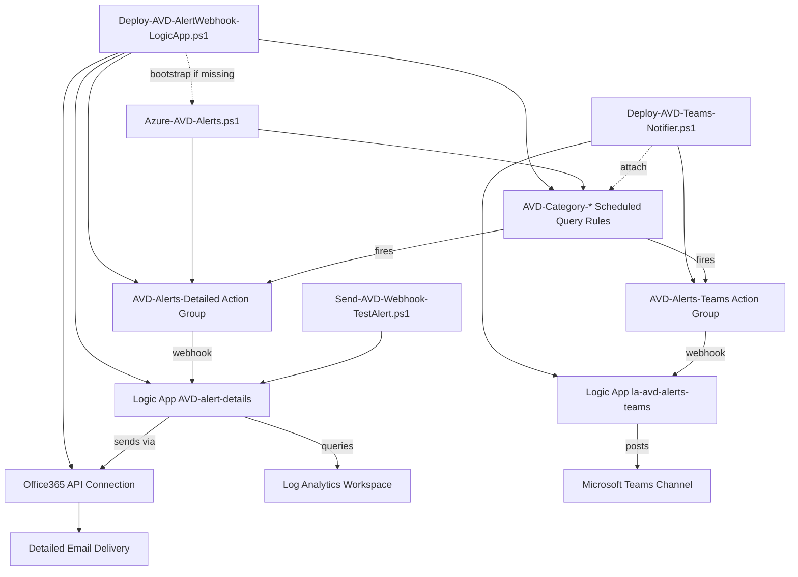
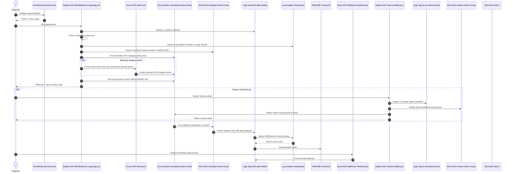

# AVD Alerts Scripts Guide

**Last Updated:** March 2026

This folder contains production-focused PowerShell scripts for deploying and maintaining Azure Virtual Desktop (AVD) alerting.

These scripts are designed to *complement Azure Virtual Desktop Insights* by adding proactive, category-based alerting from Log Analytics data.

## Scripts In Scope

1. `Azure-AVD-Alerts.ps1`
Creates and maintains core `AVD-Category-*` scheduled query alerts and the webhook action group (`AVD-Alerts-Detailed`). Called automatically by `Deploy-AVD-AlertWebhook-LogicApp.ps1` to bootstrap missing alerts.

2. `Deploy-AVD-AlertWebhook-LogicApp.ps1`
Deploys/updates the detailed email Logic App (`AVD-alert-details`), ensures Office365 API connection exists, assigns Log Analytics Reader to Logic App managed identity, ensures detailed webhook action group (`AVD-Alerts-Detailed`), and automatically switches existing `AVD-Category-*` scheduled query alerts to detailed-only action group routing.

3. `Deploy-AVD-Teams-Notifier.ps1`
Deploys a Teams notifier Logic App (`la-avd-alerts-teams`), creates a Teams webhook action group (`AVD-Alerts-Teams`), and optionally attaches it to existing `AVD-Category-*` alerts for Microsoft Teams channel notifications.

4. `AzureRoles-precheck.ps1`
Validates required RBAC permissions for deploying and maintaining the alert stack.

5. `Send-AVD-Webhook-TestAlert.ps1`
Posts a synthetic Azure Monitor common alert payload to validate the detailed webhook flow end-to-end.

## Run Order

1. Use `AzureRoles-precheck.ps1` before deployment or role changes.
2. Run `Deploy-AVD-AlertWebhook-LogicApp.ps1` — this is the single deployment entry point.
3. The webhook script auto-creates missing `AVD-Category-*` alerts via `Azure-AVD-Alerts.ps1` (if needed), then switches routing to detailed-only.
4. Optionally run `Deploy-AVD-Teams-Notifier.ps1` to add Teams channel notifications.
5. Optionally run `Send-AVD-Webhook-TestAlert.ps1` to validate callback processing.

## Dependency Diagram



## Execution Sequence



## Prerequisites

- Azure CLI installed and authenticated (`az login`)
- Azure CLI `scheduled-query` extension available
- Target Log Analytics workspace receiving AVD diagnostics
- Required RBAC on target subscription/resource groups/workspace
- For webhook email delivery: authorize the Office 365 API connection (for example, `avd-alerts-office365`) in Azure Portal using valid mailbox credentials

## Post-Deployment: Authorize Office 365 Connection

After deploying `Deploy-AVD-AlertWebhook-LogicApp.ps1`, the Office 365 API connection must be manually authorized in Azure Portal before emails will send.

1. Navigate to: **Azure Portal** → **Resource Group** → **API Connections** → `avd-alerts-office365` (or your chosen `-Office365ConnectionName`).
2. Click **Edit API connection** → **Authorize** → sign in with a mailbox that has send-as permission for the `-SendFromEmail` address.
3. Click **Save**.
4. Optionally run `Send-AVD-Webhook-TestAlert.ps1` to verify end-to-end delivery.

> **Note:** Until this step is completed, the Logic App will execute but email delivery will fail with an Office 365 connector authorization error.

## Minimum RBAC / Roles

| Script | Minimum RBAC / Role | Identity / Principal Impact | Notes |
|---|---|---|---|
| `Azure-AVD-Alerts.ps1` | `Monitoring Contributor` on target resource group + workspace read access | No new identity or principal is created. | Creates/updates scheduled query alerts and webhook action group. Called automatically by `Deploy-AVD-AlertWebhook-LogicApp.ps1`. |
| `Deploy-AVD-AlertWebhook-LogicApp.ps1` | `Contributor` on target resource group, plus permission to assign roles at LAW scope (`User Access Administrator` or `Owner`, or equivalent `Microsoft.Authorization/roleAssignments/write`) | Creates/enables Logic App **system-assigned managed identity** (service principal in Entra ID) and creates/updates a role assignment for it. | Deploys Logic App, manages Office365 connection/action group, assigns `Log Analytics Reader` to Logic App MI. |
| `AzureRoles-precheck.ps1` | Read access to role assignments/role definitions in relevant scopes | No new identity or principal is created. | Evaluates required Azure actions across scopes. |
| `Deploy-AVD-Teams-Notifier.ps1` | `Contributor` on target resource group | Creates Logic App system-assigned managed identity (for HTTP trigger). | Deploys Teams notifier Logic App, creates Teams webhook action group, optionally attaches to `AVD-Category-*` alerts. |
| `Send-AVD-Webhook-TestAlert.ps1` | `Logic App Contributor` (or `Contributor`) on target resource group | No new identity or principal is created. | Resolves callback URL and invokes test payload. |

## What Each Script Changes

| Script | Azure Resources Changed | Identity / Principal Changes | External Calls | Local Files |
|---|---|---|---|---|
| `Azure-AVD-Alerts.ps1` | Creates/updates `AVD-Category-*` scheduled query rules, ensures/uses `AVD-Alerts-Detailed` webhook action group | None. No managed identity, app registration, or principal is created. | Azure control plane via `az` | Writes CSV report (`avd-alerts-report*.csv`) |
| `Deploy-AVD-AlertWebhook-LogicApp.ps1` | Creates/updates Logic App `AVD-alert-details`, ensures `Microsoft.Web/connections` (Office365), ensures `AVD-Alerts-Detailed` receiver, bootstraps missing `AVD-Category-*` alerts, and switches those alerts to detailed-only action group routing | Enables/creates Logic App system-assigned managed identity and creates/updates its `Log Analytics Reader` role assignment at workspace scope. | Azure control plane; Logic App runtime calls Log Analytics and Office365 connector | Temporary deployment JSON in OS temp path (cleaned up) |
| `AzureRoles-precheck.ps1` | No persistent resource changes | None. Read-only permission evaluation. | Azure control plane reads role assignments/definitions | No local output by default |
| `Deploy-AVD-Teams-Notifier.ps1` | Creates/updates Logic App `la-avd-alerts-teams`, creates `AVD-Alerts-Teams` webhook action group, optionally attaches Teams action group to existing `AVD-Category-*` alerts | Enables/creates Logic App system-assigned managed identity | Azure control plane; Logic App runtime posts formatted message to Teams webhook URL | No persistent local output |
| `Send-AVD-Webhook-TestAlert.ps1` | No persistent resource changes | None. Does not create identities or role assignments. | Posts sample payload to Logic App callback URL | No persistent local output |

## Sample Usage

### Deploy Rich Alerts via Webhook + Logic App (Single Script)

This command deploys/updates the Logic App webhook flow, auto-creates missing `AVD-Category-*` alerts when needed, and enforces detailed-only routing.

Steps:

1. Run `Deploy-AVD-AlertWebhook-LogicApp.ps1`.
2. The script deploys webhook infrastructure, bootstraps missing `AVD-Category-*` alerts, and switches them to detailed-only action group routing.

```powershell
pwsh -NoProfile -File .\Deploy-AVD-AlertWebhook-LogicApp.ps1 `
  -SubscriptionId "YOUR-SUBSCRIPTION-ID" `
  -ResourceGroupName "rg-avd-prod" `
  -LogicAppName "AVD-alert-details" `
  -Location "eastus2" `
  -WorkspaceName "law-avd-prod" `
  -WorkspaceResourceGroupName "rg-avd-prod" `
  -SendFromEmail "alerts@contoso.com" `
  -SendToEmails @("avd-oncall@contoso.com", "avd-manager@contoso.com") `
  -Office365ConnectionName "avd-alerts-office365"
```

Notes:

- ATTENTION: `avd-alerts-office365` (or your chosen `-Office365ConnectionName`) must be authorized in Azure Portal using valid email credentials before detailed emails will send.
- Preferred: use `-SendToEmails` for multiple recipients.
- `-WorkspaceResourceGroupName` can differ from `-ResourceGroupName` if LAW lives in a separate RG.

### RBAC Precheck (Recommended)

```powershell
pwsh -NoProfile -File .\AzureRoles-precheck.ps1 `
  -SubscriptionId "YOUR-SUBSCRIPTION-ID" `
  -ResourceGroupName "rg-avd-prod" `
  -WorkspaceName "law-avd-prod" `
  -WorkspaceResourceGroupName "rg-avd-prod" `
  -RequireRoleAssignmentWrite
```

Add `-RequireWebhookTest` if you plan to run `Send-AVD-Webhook-TestAlert.ps1`.

### Test Payload Sender (Optional)

```powershell
pwsh -NoProfile -File .\Send-AVD-Webhook-TestAlert.ps1 `
  -ResourceGroup "rg-avd-prod" `
  -LogicAppName "AVD-alert-details"
```

### Deploy Teams Channel Notifications (Optional)

```powershell
pwsh -NoProfile -File .\Deploy-AVD-Teams-Notifier.ps1 `
  -ResourceGroup "rg-avd-prod" `
  -Location "eastus2" `
  -TeamsWebhookUrl "https://your-org.webhook.office.com/webhookb2/..." `
  -AttachToCategoryAlerts $true
```

Notes:
- `-TeamsWebhookUrl` is a Teams incoming webhook or Workflows bot endpoint.
- `-AttachToCategoryAlerts $true` (default) automatically patches all existing `AVD-Category-*` alerts to also fire to the Teams action group.
- Use `-SkipTestInvoke` to skip the sample payload test after deployment.

## Recommended Rollout

1. Run `AzureRoles-precheck.ps1` to validate RBAC.
2. Run `Deploy-AVD-AlertWebhook-LogicApp.ps1` to deploy webhook infrastructure and alerts.
3. Authorize the Office 365 API connection in Azure Portal (see above).
4. Optionally run `Deploy-AVD-Teams-Notifier.ps1` to add Teams channel notifications.
5. Run `Send-AVD-Webhook-TestAlert.ps1` to validate end-to-end delivery.

## Troubleshooting

| Symptom | Likely Cause | Resolution |
|---|---|---|
| Logic App runs succeed but no email received | Office 365 API connection not authorized | See "Post-Deployment: Authorize Office 365 Connection" above |
| `az monitor scheduled-query create` fails with extension error | `scheduled-query` CLI extension missing | Run `az extension add --name scheduled-query` |
| Role assignment fails with `AuthorizationFailed` | Caller lacks `Microsoft.Authorization/roleAssignments/write` | Run precheck with `-RequireRoleAssignmentWrite` and grant the missing role |
| Test payload returns HTTP 401/403 | Callback URL expired or Logic App disabled | Re-run `Deploy-AVD-AlertWebhook-LogicApp.ps1` to refresh the workflow |
| CSV report missing or empty | `-CsvPath` directory does not exist | Script auto-creates the directory; check write permissions |
| Teams notifications not arriving | Incoming webhook URL expired or channel was deleted | Regenerate the webhook URL in Teams and re-run `Deploy-AVD-Teams-Notifier.ps1` |

## AVD Alert Categories

The core script deploys 16 consolidated `AVD-Category-*` alerts.

- Evaluation frequency: every `10 minutes`
- Scan/lookback window: last `15 minutes`
- Trigger behavior: alert fires when matching events are found in the window

### WVDErrors-based Categories (8 alerts)

- `AVD-Category-AuthenticationIdentity`
- `AVD-Category-AuthorizationPolicy`
- `AVD-Category-ConnectionNetworkGateway`
- `AVD-Category-SessionHostHealthCapacity`
- `AVD-Category-PersonalDesktopAssignment`
- `AVD-Category-DeviceGraphicsInput`
- `AVD-Category-FSLogixProfileStorage`
- `AVD-Category-UnknownUnclassified`

### WVD Diagnostic Log Categories (8 alerts)

Require host pool diagnostic settings routing `allLogs` to the target Log Analytics workspace.

- `AVD-Category-ConnectionFailureRate` — failed connections per host pool (WVDConnections)
- `AVD-Category-DisconnectionSpike` — abnormal disconnection rate (WVDConnections)
- `AVD-Category-UnhealthyHosts` — non-Available session hosts (WVDAgentHealthStatus)
- `AVD-Category-StaleHeartbeat` — stale agent heartbeat (WVDAgentHealthStatus)
- `AVD-Category-BandwidthDrop` — per-connection bandwidth below threshold (WVDConnectionNetworkData)
- `AVD-Category-RTTPerUser` — per-user P95 round-trip time (WVDConnectionNetworkData)
- `AVD-Category-SignInPhaseDelay` — prolonged sign-in phases (WVDCheckpoints)
- `AVD-Category-FrameQualityDegradation` — [Preview] frame delay / dropped frames (ConnectionGraphicsData)
