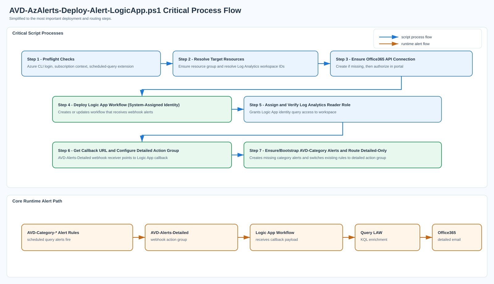

# AVD Alerts Scripts Guide

**Last Updated:** March 2026

Production-ready PowerShell scripts that deploy **16 category-based AVD alerts with rich email notifications** — going far beyond what standard Azure Monitor alert emails provide.

Standard Azure Monitor emails contain only the alert name, severity, and a portal link. These scripts deploy a **Logic App webhook pipeline** that intercepts each alert, re-queries Log Analytics for the specific time window, and sends **detailed HTML emails** containing affected host names, error codes, user names, connection IDs, and inline troubleshooting links — giving operators the data they need to act without opening the portal.

## Prerequisites

- Azure CLI installed and authenticated (`az login`)
- Azure CLI `scheduled-query` extension available
- Target Log Analytics workspace receiving AVD diagnostics
- Required RBAC on target subscription/resource groups/workspace
- For webhook email delivery: authorize the Office 365 API connection (for example, `avd-alerts-office365`) in Azure Portal using valid mailbox credentials

## Run Order

1. Use `AVD-RBAC-Precheck.ps1` before deployment or role changes.
2. Run `AVD-AzAlerts-Deploy-Alert-LogicApp.ps1` — this is the single deployment entry point.
3. The webhook script auto-creates missing `AVD-Category-*` alerts via `AVD-AzAlerts-Category-Alerts.ps1` (if needed), then switches routing to detailed-only.
4. Optionally run `AVD-Webhook-TestAlert.ps1` to validate callback processing.

## Post-Deployment: Authorize Office 365 Connection

After deploying `AVD-AzAlerts-Deploy-Alert-LogicApp.ps1`, the Office 365 API connection must be manually authorized in Azure Portal before emails will send.

1. Navigate to: **Azure Portal** → **Resource Group** → **API Connections** → `avd-alerts-office365` (or your chosen `-Office365ConnectionName`).
2. Click **Edit API connection** → **Authorize** → sign in with a mailbox that has send-as permission for the `-SendFromEmail` address.
3. Click **Save**.
4. Optionally run `AVD-Webhook-TestAlert.ps1` to verify end-to-end delivery.

> **Note:** Until this step is completed, the Logic App will execute but email delivery will fail with an Office 365 connector authorization error.

## Dependency Diagram

[](AVD-AzAlerts-Deploy-LogicApp-Steps.svg)

## Sample Usage

### Deploy Rich Alerts via Webhook + Logic App (Single Script)

This command deploys/updates the Logic App webhook flow, auto-creates missing `AVD-Category-*` alerts when needed, and enforces detailed-only routing.

Steps:

1. Run `AVD-AzAlerts-Deploy-Alert-LogicApp.ps1`.
2. The script deploys webhook infrastructure, bootstraps missing `AVD-Category-*` alerts, and switches them to detailed-only action group routing.

```powershell
pwsh -NoProfile -File .\AVD-AzAlerts-Deploy-Alert-LogicApp.ps1 `
  -SubscriptionId "YOUR-SUBSCRIPTION-ID" `
  -ResourceGroupName "rg-avd-prod" `
  -LogicAppName "AVD-alert-details" `
  -Location "eastus2" `
  -WorkspaceName "law-avd-prod" `
  -WorkspaceResourceGroupName "rg-avd-prod" `
  -SendFromEmail "alerts@contoso.com" `
  -SendToEmails @("avd-oncall@contoso.com", "avd-manager@contoso.com") `
  -Office365ConnectionName "avd-alerts-office365"
```

Notes:

- ATTENTION: `avd-alerts-office365` (or your chosen `-Office365ConnectionName`) must be authorized in Azure Portal using valid email credentials before detailed emails will send.
- Preferred: use `-SendToEmails` for multiple recipients.
- `-WorkspaceResourceGroupName` can differ from `-ResourceGroupName` if LAW lives in a separate RG.

### RBAC Precheck (Recommended)

```powershell
pwsh -NoProfile -File .\AVD-RBAC-Precheck.ps1 `
  -SubscriptionId "YOUR-SUBSCRIPTION-ID" `
  -ResourceGroupName "rg-avd-prod" `
  -WorkspaceName "law-avd-prod" `
  -WorkspaceResourceGroupName "rg-avd-prod" `
  -RequireRoleAssignmentWrite
```

Add `-RequireWebhookTest` if you plan to run `AVD-Webhook-TestAlert.ps1`.

### Test Payload Sender (Optional)

```powershell
pwsh -NoProfile -File .\AVD-Webhook-TestAlert.ps1 `
  -ResourceGroup "rg-avd-prod" `
  -LogicAppName "AVD-alert-details"
```

## Script Reference

| # | Script | Purpose | What It Does | Quick Start (copy & paste) |
| -- | ------ | ------- | ------------ | -------------------------- |
| 1 | `AVD-RBAC-Precheck.ps1` | Validate RBAC permissions | Evaluates whether the signed-in user has the required Azure RBAC actions across resource group, workspace, and subscription scopes. Outputs a permission report. Read-only. | `\.\AVD-RBAC-Precheck.ps1 -SubscriptionId "YOUR-SUB-ID" -ResourceGroupName "YOUR-RG" -WorkspaceName "YOUR-LAW" -WorkspaceResourceGroupName "YOUR-LAW-RG"` |
| 2 | `AVD-AzAlerts-Deploy-Alert-LogicApp.ps1` | **Primary: deploy alerts + email pipeline** | Creates/updates the Logic App workflow, Office 365 API connection, webhook action group, assigns Log Analytics Reader to the Logic App managed identity, and bootstraps all 16 `AVD-Category-*` scheduled query alerts. Single command does everything. | `\.\AVD-AzAlerts-Deploy-Alert-LogicApp.ps1 -SubscriptionId "YOUR-SUB-ID" -ResourceGroupName "YOUR-RG" -LogicAppName "AVD-alert-details" -Location "eastus2" -WorkspaceName "YOUR-LAW" -WorkspaceResourceGroupName "YOUR-LAW-RG" -SendFromEmail "alerts@contoso.com" -SendToEmails "team@contoso.com"` |
| 3 | `AVD-AzAlerts-Category-Alerts.ps1` | Create alert rules only | Creates and maintains `AVD-Category-*` scheduled query alerts and the webhook action group. Called automatically by script #2 — run directly only for standalone alert creation without the Logic App. | `\.\AVD-AzAlerts-Category-Alerts.ps1 -DetailedResultsWebhookUrl "https://your-logicapp-callback-url"` |
| 4 | `AVD-Webhook-TestAlert.ps1` | Test webhook delivery | Posts a synthetic Azure Monitor alert payload to a Logic App callback URL to verify end-to-end email delivery. | `\.\AVD-Webhook-TestAlert.ps1 -ResourceGroup "YOUR-RG" -LogicAppName "AVD-alert-details"` |

## Access and Change Impact by Script

Use this single matrix to understand required access, what each script changes, and any identity side effects.

| Script | Minimum Access | Azure Resources Changed | Identity Impact | Runtime Calls / Local Output |
| --- | --- | --- | --- | --- |
| `AVD-RBAC-Precheck.ps1` | Read access to role assignments and role definitions in relevant scopes | None (read-only validation) | None | Azure control plane reads only; no local output by default |
| `AVD-AzAlerts-Deploy-Alert-LogicApp.ps1` | `Contributor` on target resource group plus role-assignment write at LAW scope (`User Access Administrator`, `Owner`, or equivalent `Microsoft.Authorization/roleAssignments/write`) | Creates/updates Logic App (`AVD-alert-details`), Office365 API connection, detailed action group receiver, and bootstraps/retargets `AVD-Category-*` alerts | Creates/enables Logic App system-assigned managed identity and assigns `Log Analytics Reader` at workspace scope | Azure control plane + Logic App runtime calls to Log Analytics and Office365; writes temporary deployment JSON (cleaned up) |
| `AVD-AzAlerts-Category-Alerts.ps1` | `Monitoring Contributor` on target resource group plus workspace read access | Creates/updates `AVD-Category-*` scheduled query rules and ensures/uses `AVD-Alerts-Detailed` action group | None | Azure control plane via `az`; writes CSV report (`avd-alerts-report*.csv`) |
| `AVD-Webhook-TestAlert.ps1` | `Logic App Contributor` (or `Contributor`) on target resource group | No persistent resource changes (test payload only) | None | Posts synthetic payload to Logic App callback URL; no persistent local output |

## Troubleshooting

| Symptom | Likely Cause | Resolution |
| --- | --- | --- |
| Logic App runs succeed but no email received | Office 365 API connection not authorized | See "Post-Deployment: Authorize Office 365 Connection" above |
| `az monitor scheduled-query create` fails with extension error | `scheduled-query` CLI extension missing | Run `az extension add --name scheduled-query` |
| Role assignment fails with `AuthorizationFailed` | Caller lacks `Microsoft.Authorization/roleAssignments/write` | Run precheck with `-RequireRoleAssignmentWrite` and grant the missing role |
| Test payload returns HTTP 401/403 | Callback URL expired or Logic App disabled | Re-run `AVD-AzAlerts-Deploy-Alert-LogicApp.ps1` to refresh the workflow |
| CSV report missing or empty | `-CsvPath` directory does not exist | Script auto-creates the directory; check write permissions |

## AVD Alert Categories

The core script deploys 16 consolidated `AVD-Category-*` alerts.

- Evaluation frequency: every `10 minutes`
- Scan/lookback window: last `15 minutes`
- Trigger behavior: alert fires when matching events are found in the window

### WVDErrors-based Categories (8 alerts)

- `AVD-Category-AuthenticationIdentity`
- `AVD-Category-AuthorizationPolicy`
- `AVD-Category-ConnectionNetworkGateway`
- `AVD-Category-SessionHostHealthCapacity`
- `AVD-Category-PersonalDesktopAssignment`
- `AVD-Category-DeviceGraphicsInput`
- `AVD-Category-FSLogixProfileStorage`
- `AVD-Category-UnknownUnclassified`

### WVD Diagnostic Log Categories (8 alerts)

Require host pool diagnostic settings routing `allLogs` to the target Log Analytics workspace.

- `AVD-Category-ConnectionFailureRate` — failed connections per host pool (WVDConnections)
- `AVD-Category-DisconnectionSpike` — abnormal disconnection rate (WVDConnections)
- `AVD-Category-UnhealthyHosts` — non-Available session hosts (WVDAgentHealthStatus)
- `AVD-Category-StaleHeartbeat` — stale agent heartbeat (WVDAgentHealthStatus)
- `AVD-Category-BandwidthDrop` — per-connection bandwidth below threshold (WVDConnectionNetworkData)
- `AVD-Category-RTTPerUser` — per-user P95 round-trip time (WVDConnectionNetworkData)
- `AVD-Category-SignInPhaseDelay` — prolonged sign-in phases (WVDCheckpoints)
- `AVD-Category-FrameQualityDegradation` — [Preview] frame delay / dropped frames (ConnectionGraphicsData)
