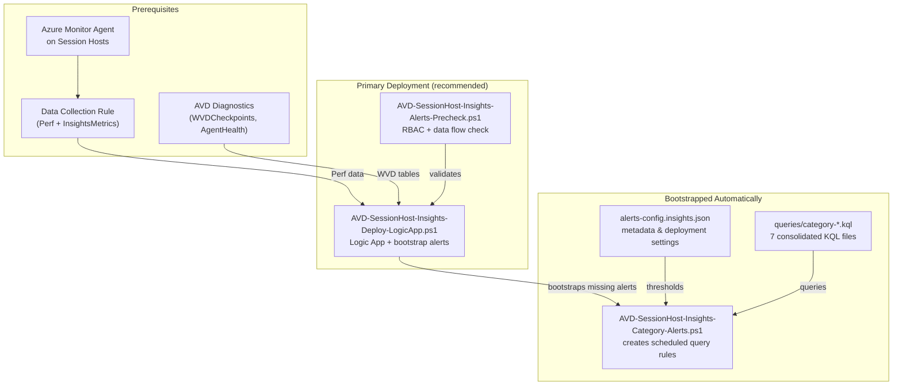

# AVD Session Host Insights Alerts

**Rich performance and session lifecycle alerting** for Azure Virtual Desktop — delivering detailed, operator-friendly HTML emails that go beyond standard Azure Monitor notifications.

Standard Azure Monitor alert emails show only the alert name and a portal link. These alerts use a **Logic App webhook pipeline** that re-queries Log Analytics when an alert fires, producing emails with specific counter values, affected session host names, threshold breaches, and inline troubleshooting context — so operators can assess and act without opening the Azure Portal.

Driven by AVD session hosts Insights data: Perf counters (28 metrics via DCR), WVDCheckpoints, and WVDAgentHealthStatus.

## Prerequisites

1. **Azure Monitor Agent (AMA)** deployed on session hosts
2. **Data Collection Rule** sending Perf counters to your Log Analytics workspace
  (See [AVD-Insights-Enable-PerfMetrics-Monitoring.ps1](../AVD-SessionHostMonitoring/AVD-Insights-Enable-PerfMetrics-Monitoring.ps1))
3. **AVD Diagnostics** enabled (WVDCheckpoints, WVDAgentHealthStatus tables)
4. **Azure CLI** with `scheduled-query` extension
5. RBAC: **Monitoring Contributor** + **Log Analytics Reader** (or Owner/Contributor)

## Overview

This solution **complements** the existing [AVD-AzAlerts](../../AVD-AzAlerts/) WVDErrors-category alerts by monitoring the session host **performance counters** and **session lifecycle signals** that AVD Insights collects via Azure Monitor Agent and Data Collection Rules.

### What It Monitors

| Category | Alert Rule | Signals | Data Source |
|----------|-----------|---------|-------------|
| Session Quality | AVD-SessionHost-Insights-Category-SessionQuality | InputDelay (Process/Session), RTT Latency, UDP Bandwidth | Perf (User Input Delay, RemoteFX Network) |
| Host Performance | AVD-SessionHost-Insights-Category-HostPerformance | CPU, Memory, Commit Ratio, Pages/sec, Page Faults, Disk Timing | Perf (Processor, Memory, LogicalDisk) |
| Disk Health | AVD-SessionHost-Insights-Category-DiskHealth | Queue Length, Free Space | Perf (PhysicalDisk, LogicalDisk) |
| Session Lifecycle | AVD-SessionHost-Insights-Category-SessionLifecycle | Sign-In Duration, Capacity Pressure, Session Imbalance | WVDCheckpoints, WVDAgentHealthStatus, Perf (Terminal Services) |
| Correlated Signals | AVD-SessionHost-Insights-Category-CorrelatedSignals | Multi-signal Hosts, FSLogix+Perf | Perf + WVDCheckpoints + Event |
| Event Log Alerts | AVD-SessionHost-Insights-Category-EventLogAlerts | FSLogix Profile Error | Event (FSLogix operational/admin logs) |
| GPU Performance | AVD-SessionHost-Insights-Category-GPUPerformance | GPU Encoding Time | Perf (RemoteFX Graphics) |

**7 category-consolidated alerts** (covering 19 sub-signals) across 7 categories. Each category alert unions all its sub-signals into a single scheduled-query rule — the alert fires when ANY signal in the category breaches its threshold. Deployed thresholds are defined in `queries/category-*.kql`; `alerts-config.insights.json` is metadata and deployment settings.

## Script Reference

| # | Script | Purpose | What It Does | Quick Start (copy & paste) |
| -- | ------ | ------- | ------------ | -------------------------- |
| 1 | `AVD-SessionHost-Insights-Alerts-Precheck.ps1` | Validate prerequisites | Checks RBAC permissions, Azure CLI extensions, LAW connectivity, and verifies Perf counter data flow. Read-only — no changes made. | `.\AVD-SessionHost-Insights-Alerts-Precheck.ps1 -SubscriptionId "YOUR-SUB-ID" -ResourceGroupName "YOUR-RG" -WorkspaceName "YOUR-LAW"` |
| 2 | `AVD-SessionHost-Insights-Deploy-LogicApp.ps1` | **Primary: deploy alerts + email pipeline** | Creates/updates the Logic App, Office 365 API connection, webhook action group, assigns Log Analytics Reader to the Logic App managed identity, and bootstraps all 7 `AVD-SessionHost-Insights-Category-*` alerts. Single command does everything. | `.\AVD-SessionHost-Insights-Deploy-LogicApp.ps1 -SubscriptionId "YOUR-SUB-ID" -ResourceGroupName "YOUR-RG" -LogicAppName "AVD-SessionHost-Insights-Alert-Email" -Location "eastus2" -WorkspaceName "YOUR-LAW" -WorkspaceResourceGroupName "YOUR-LAW-RG" -SendFromEmail "alerts@contoso.com" -SendToEmail "team@contoso.com"` |
| 3 | `AVD-SessionHost-Insights-Category-Alerts.ps1` | Create alert rules only | Reads definitions from `alerts-config.insights.json`, loads KQL query files, and creates Azure Monitor scheduled query rules. Called automatically by script #2 — run directly only for standalone alert creation or re-deploy after threshold changes. | `.\AVD-SessionHost-Insights-Category-Alerts.ps1 -ResourceGroup "YOUR-RG" -WorkspaceName "YOUR-LAW" -Location "eastus2"` |

**Additional modes:**

| Mode | Command |
| ---- | ------- |
| WhatIf (dry run) | `.\AVD-SessionHost-Insights-Category-Alerts.ps1 -ResourceGroup "YOUR-RG" -WorkspaceName "YOUR-LAW" -Location "eastus2" -WhatIf` |
| Single category | `.\AVD-SessionHost-Insights-Category-Alerts.ps1 -ResourceGroup "YOUR-RG" -WorkspaceName "YOUR-LAW" -Location "eastus2" -CategoryFilter "HostPerformance"` |
| Override severity | `.\AVD-SessionHost-Insights-Category-Alerts.ps1 -ResourceGroup "YOUR-RG" -WorkspaceName "YOUR-LAW" -Location "eastus2" -Severity 1` |

## File Structure

```
AVD-SessionHost-Insights-Alerts/
├── alerts-config.insights.json          # Alert definitions and thresholds (7 categories)
├── queries/                             # KQL query files
│   ├── category-session-quality.kql     # Consolidated: InputDelay + RTT + UDP
│   ├── category-host-performance.kql    # Consolidated: CPU + Memory + Disk Timing
│   ├── category-disk-health.kql         # Consolidated: Queue Length + Free Space
│   ├── category-session-lifecycle.kql   # Consolidated: SignIn + Capacity + Imbalance
│   ├── category-correlated-signals.kql  # Consolidated: Multi-signal + FSLogix
│   ├── category-event-log-alerts.kql    # FSLogix profile errors
│   ├── category-gpu-performance.kql     # GPU encoding time
│   ├── input-delay.kql                  # Individual signal reference query (analysis/testing)
│   ├── round-trip-latency.kql
│   ├── input-delay-session.kql
│   ├── udp-bandwidth.kql
│   ├── cpu-saturation.kql
│   ├── memory-pressure.kql
│   ├── memory-commit-ratio.kql
│   ├── memory-pages-per-sec.kql
│   ├── page-faults.kql
│   ├── disk-timing.kql
│   ├── disk-queue-length.kql
│   ├── disk-free-space.kql
│   ├── signin-degradation.kql
│   ├── capacity-pressure.kql
│   ├── session-imbalance.kql
│   ├── correlated-hosts.kql
│   ├── fslogix-correlation.kql
│   ├── fslogix-profile-error.kql
│   └── gpu-encoding-time.kql
├── AVD-SessionHost-Insights-Deploy-LogicApp.ps1  # **Primary**: deploys Logic App + bootstraps alerts
├── AVD-SessionHost-Insights-Category-Alerts.ps1  # Advanced: deploy/update alerts only
├── AVD-SessionHost-Insights-Alerts-Precheck.ps1  # RBAC & data flow validation
├── README.md                            # This file
├── Insights-Alert-Matrix.md             # Alert reference matrix
└── Insights-Runbook.md                  # Operational runbook
```

## Deployment

### Recommended: Single-Command Deploy (Logic App + Alerts)

The **primary entry point** is `AVD-SessionHost-Insights-Deploy-LogicApp.ps1`. It deploys the Logic App email pipeline and automatically **bootstraps any missing AVD Session Host Insights Alerts rules** via `AVD-SessionHost-Insights-Category-Alerts.ps1`. If all 7 category alerts already exist, the bootstrap step is skipped.

#### Step 1 (Optional): Run Pre-Checks

```powershell
.\AVD-SessionHost-Insights-Alerts-Precheck.ps1 `
  -SubscriptionId "YOUR-SUBSCRIPTION-ID" `
  -ResourceGroupName "rg-avd-prod" `
  -WorkspaceName "law-avd-prod"
```

This validates RBAC, Azure CLI extensions, LAW connectivity, and verifies Perf counter data flow.

#### Step 2: Deploy Everything

```powershell
.\AVD-SessionHost-Insights-Deploy-LogicApp.ps1 `
  -SubscriptionId "YOUR-SUBSCRIPTION-ID" `
  -ResourceGroupName "rg-avd-prod" `
  -LogicAppName "AVD-SessionHost-Insights-Alert-Email" `
  -Location "eastus2" `
  -WorkspaceName "law-avd-prod" `
  -WorkspaceResourceGroupName "rg-avd-prod" `
  -SendToEmail "avdops@contoso.com" `
  -SendFromEmail "alerts@contoso.com"
```

This single command will:
1. Create/update the Office 365 API connection
2. Resolve the Log Analytics workspace
3. Deploy the Logic App with system-assigned managed identity
4. Assign **Log Analytics Reader** RBAC to the Logic App identity
5. Create the **AVD-SessionHost-Insights-Detailed** webhook action group pointing to the Logic App callback URL
6. **Bootstrap** any missing session host insights category alerts (calls `AVD-SessionHost-Insights-Category-Alerts.ps1` internally)
7. Switch all session host insights alerts to the detailed-only action group

> **Note:** The Office 365 API connection may require manual authorization in Azure Portal before emails flow.

### Advanced: Deploy Alerts Only

Use `AVD-SessionHost-Insights-Category-Alerts.ps1` directly when you need to:
- Deploy alerts **without** the Logic App email pipeline
- Re-deploy or update specific alerts (e.g., after editing KQL thresholds)
- Use a different action group or webhook target

```powershell
.\AVD-SessionHost-Insights-Category-Alerts.ps1 `
  -ResourceGroup "rg-avd-prod" `
  -WorkspaceName "law-avd-prod" `
  -Location "eastus2" `
  -WebhookUrl "https://your-webhook-url"
```

## Common Operations

### Preview Changes (Dry Run)

```powershell
.\AVD-SessionHost-Insights-Category-Alerts.ps1 -ResourceGroup "rg-avd" -WorkspaceName "law-avd" -Location "eastus2" -WhatIf
```

### Deploy a Single Category

```powershell
.\AVD-SessionHost-Insights-Category-Alerts.ps1 ... -CategoryFilter "HostPerformance"
```

### Deploy a Single Alert

```powershell
.\AVD-SessionHost-Insights-Category-Alerts.ps1 ... -AlertFilter "AVD-SessionHost-Insights-Category-HostPerformance"
```

### Override Severity

```powershell
.\AVD-SessionHost-Insights-Category-Alerts.ps1 ... -Severity 1   # Error
```

### Tune Thresholds

Thresholds are defined as `let` variables at the top of each `queries/category-*.kql` file. Edit the KQL files directly to change thresholds, then re-deploy with `-CreateOnly $false`. The `alerts-config.insights.json` file provides alert metadata and deployment settings; it does not inject threshold values into KQL during deployment.

## Dependency Diagram



## Related

- [AVD-AzAlerts](../../AVD-AzAlerts/) - WVDErrors category alerts (connection failures, auth errors)
- [AVD-Insights-Enable-PerfMetrics-Monitoring.ps1](../AVD-SessionHostMonitoring/AVD-Insights-Enable-PerfMetrics-Monitoring.ps1) - DCR and AMA setup
- [Insights-Alert-Matrix.md](Insights-Alert-Matrix.md) - Full alert reference
- [Insights-Runbook.md](Insights-Runbook.md) - Operational procedures
