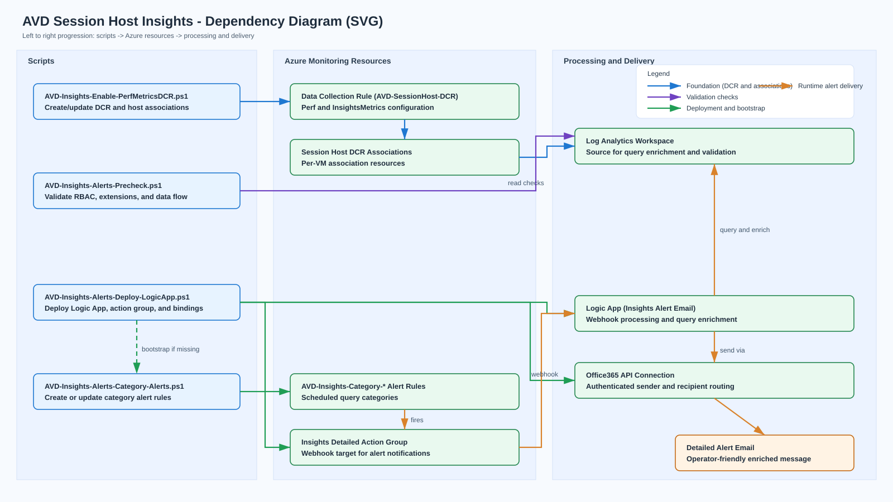

# AVD Session Host Insights Scripts Guide

**Last Updated:** March 2026

Production-ready PowerShell scripts that deploy AVD session host performance monitoring foundations and **7 category-based Insights alerts with rich email notifications**.

Standard Azure Monitor alert emails usually contain limited context. This workflow builds the monitoring baseline first (DCR plus host associations), then deploys a Logic App webhook pipeline that enriches alert payloads with query results from Log Analytics so operators receive actionable details without digging through multiple portal blades.

## Prerequisites

- Azure CLI installed and authenticated (`az login`)
- Azure CLI `desktopvirtualization` extension available (auto-installed by the DCR script if missing)
- Azure CLI `scheduled-query` extension available (required for alert rule deployment)
- Target Log Analytics workspace receiving AVD diagnostics and Perf counter data
- Required RBAC on target subscription, resource groups, and workspace
- Azure Monitor Agent deployment handled separately (recommended: Azure Policy)
- For webhook email delivery: authorize the Office 365 API connection after deployment in Azure Portal

## Run Order

1. Run [`AVD-Insights-Enable-PerfMetricsDCR.ps1`](AVD-Insights-Enable-PerfMetricsDCR.ps1) to create/update DCR and associate it with session hosts.
2. Run [`AVD-Insights-Alerts-Precheck.ps1`](../AVD-SessionHost-Insights-Alerts/AVD-Insights-Alerts-Precheck.ps1) to validate Insights alert prerequisites.
3. Run [`AVD-Insights-Alerts-Deploy-LogicApp.ps1`](../AVD-SessionHost-Insights-Alerts/AVD-Insights-Alerts-Deploy-LogicApp.ps1) as the single deployment entry point for detailed alert email delivery.
4. Optionally run [`AVD-Insights-Alerts-Category-Alerts.ps1`](../AVD-SessionHost-Insights-Alerts/AVD-Insights-Alerts-Category-Alerts.ps1) for alerts-only updates.

## Recommended Rollout

1. Run [`AVD-Insights-Enable-PerfMetricsDCR.ps1`](AVD-Insights-Enable-PerfMetricsDCR.ps1) to establish DCR and host associations.
2. Confirm data starts flowing to both `InsightsMetrics` and `Perf` tables.
3. Run [`AVD-Insights-Alerts-Precheck.ps1`](../AVD-SessionHost-Insights-Alerts/AVD-Insights-Alerts-Precheck.ps1) to validate alert prerequisites.
4. Run [`AVD-Insights-Alerts-Deploy-LogicApp.ps1`](../AVD-SessionHost-Insights-Alerts/AVD-Insights-Alerts-Deploy-LogicApp.ps1) to deploy detailed alert routing.
5. Authorize Office 365 API connection in Azure Portal.
6. Re-run precheck and validate first test alert end to end.

## Sample Usage

### Deploy Monitoring Foundation (DCR plus Associations)

```powershell
pwsh -NoProfile -File ./AVD-Insights-Enable-PerfMetricsDCR.ps1 `
  -SubscriptionId "YOUR-SUBSCRIPTION-ID" `
  -LawRG "rg-avd-monitoring" `
  -LawName "law-avd-prod" `
  -DcrRG "rg-avd-monitoring" `
  -DcrName "AVD-SessionHost-DCR" `
  -Location "eastus2"
```

Interactive prompt/output example:

```text
Discovered 5 host pool(s):
  [1] AVD-Pooled  (RG: rg-avd-pooled)
  [2] Contoso-AppSharePool  (RG: rg-avd-monitoring)
  [3] Contoso-EntraID-HostPool  (RG: rg-avd-entra)
  [4] Personal-Pool  (RG: rg-avd-monitoring)
  [5] SharedDesktops-Pool  (RG: rg-avd-shared)

Associate DCR 'AVD-SessionHost-DCR' with session hosts in:
  [A] All host pools
  [S] Select specific host pools
  [N] Skip

Choice:
```

### Deploy Rich Insights Alerts (Logic App Entry Point)

```powershell
pwsh -NoProfile -File ../AVD-SessionHost-Insights-Alerts/AVD-Insights-Alerts-Deploy-LogicApp.ps1 `
  -SubscriptionId "YOUR-SUBSCRIPTION-ID" `
  -ResourceGroupName "rg-avd-prod" `
  -LogicAppName "AVD-Insights-Alert-Email" `
  -Location "eastus2" `
  -WorkspaceName "law-avd-prod" `
  -WorkspaceResourceGroupName "rg-avd-prod" `
  -SendFromEmail "alerts@contoso.com" `
  -SendToEmail "avd-oncall@contoso.com"
```

### Validate Prerequisites and Data Flow

```powershell
pwsh -NoProfile -File ../AVD-SessionHost-Insights-Alerts/AVD-Insights-Alerts-Precheck.ps1 `
  -SubscriptionId "YOUR-SUBSCRIPTION-ID" `
  -ResourceGroupName "rg-avd-prod" `
  -WorkspaceName "law-avd-prod"
```

## Post-Deployment: Authorize Office 365 Connection

After deploying [`AVD-Insights-Alerts-Deploy-LogicApp.ps1`](../AVD-SessionHost-Insights-Alerts/AVD-Insights-Alerts-Deploy-LogicApp.ps1), the Office 365 API connection must be manually authorized in Azure Portal before emails will send.

1. Navigate to: **Azure Portal** -> **Resource Group** -> **API Connections** -> your Insights Office 365 connection.
2. Click **Edit API connection** -> **Authorize** -> sign in with a mailbox that can send as the `-SendFromEmail` identity.
3. Click **Save**.
4. Re-run [`AVD-Insights-Alerts-Precheck.ps1`](../AVD-SessionHost-Insights-Alerts/AVD-Insights-Alerts-Precheck.ps1) to confirm readiness.

> **Note:** Until authorization is complete, alert rules can fire but email delivery from the Logic App will fail.

## Dependency Diagram

Click the diagram to open the full-size SVG:

[](AVD-Insights-Dependency-Diagram.svg)

## Script Reference

| # | Script | Purpose | What It Does | Quick Start (copy and paste) |
| -- | ------ | ------- | ------------ | ----------------------------- |
| 1 | [`AVD-Insights-Enable-PerfMetricsDCR.ps1`](AVD-Insights-Enable-PerfMetricsDCR.ps1) | Deploy DCR for Perf counters | Creates/updates a Data Collection Rule for 28 counters, auto-discovers AVD host pools, and interactively associates the DCR with session hosts. | `./AVD-Insights-Enable-PerfMetricsDCR.ps1 -SubscriptionId "YOUR-SUB-ID" -LawRG "YOUR-LAW-RG" -LawName "YOUR-LAW" -DcrRG "YOUR-DCR-RG" -DcrName "AVD-SessionHost-DCR" -Location "eastus2"` |
| 2 | [`AVD-Insights-Alerts-Precheck.ps1`](../AVD-SessionHost-Insights-Alerts/AVD-Insights-Alerts-Precheck.ps1) | Validate Insights prerequisites | Checks RBAC, extension readiness, workspace connectivity, and required data flow for Insights alerts. Read-only. | `../AVD-SessionHost-Insights-Alerts/AVD-Insights-Alerts-Precheck.ps1 -SubscriptionId "YOUR-SUB-ID" -ResourceGroupName "YOUR-RG" -WorkspaceName "YOUR-LAW"` |
| 3 | [`AVD-Insights-Alerts-Deploy-LogicApp.ps1`](../AVD-SessionHost-Insights-Alerts/AVD-Insights-Alerts-Deploy-LogicApp.ps1) | **Primary: deploy alerts plus email pipeline** | Creates/updates Logic App, API connection, detailed action group, managed identity role assignment, and bootstraps all 7 `AVD-Insights-Category-*` alerts. | `../AVD-SessionHost-Insights-Alerts/AVD-Insights-Alerts-Deploy-LogicApp.ps1 -SubscriptionId "YOUR-SUB-ID" -ResourceGroupName "YOUR-RG" -LogicAppName "AVD-Insights-Alert-Email" -Location "eastus2" -WorkspaceName "YOUR-LAW" -WorkspaceResourceGroupName "YOUR-LAW-RG" -SendFromEmail "alerts@contoso.com" -SendToEmail "team@contoso.com"` |
| 4 | [`AVD-Insights-Alerts-Category-Alerts.ps1`](../AVD-SessionHost-Insights-Alerts/AVD-Insights-Alerts-Category-Alerts.ps1) | Create alert rules only | Creates and maintains `AVD-Insights-Category-*` scheduled query alerts from config and KQL files. Called automatically by script #3. | `../AVD-SessionHost-Insights-Alerts/AVD-Insights-Alerts-Category-Alerts.ps1 -ResourceGroup "YOUR-RG" -WorkspaceName "YOUR-LAW" -Location "eastus2"` |

## Access and Change Impact by Script

| Script | Minimum Access | Azure Resources Changed | Identity Impact | Runtime Calls / Local Output |
| --- | --- | --- | --- | --- |
| [`AVD-Insights-Enable-PerfMetricsDCR.ps1`](AVD-Insights-Enable-PerfMetricsDCR.ps1) | Monitoring Contributor on DCR and LAW scopes; Desktop Virtualization Reader for host pool discovery | Creates/updates DCR and VM DCR associations | None | Azure control-plane calls via `az`; interactive console output |
| [`AVD-Insights-Alerts-Precheck.ps1`](../AVD-SessionHost-Insights-Alerts/AVD-Insights-Alerts-Precheck.ps1) | Read access to relevant resource scopes | None (read-only validation) | None | Azure read calls and validation output |
| [`AVD-Insights-Alerts-Deploy-LogicApp.ps1`](../AVD-SessionHost-Insights-Alerts/AVD-Insights-Alerts-Deploy-LogicApp.ps1) | Contributor on target RG plus role assignment write at workspace scope | Creates/updates Logic App, Office365 API connection, action group, and alert bindings | Enables system-assigned managed identity and assigns workspace reader role | Azure control-plane calls; deployment output |
| [`AVD-Insights-Alerts-Category-Alerts.ps1`](../AVD-SessionHost-Insights-Alerts/AVD-Insights-Alerts-Category-Alerts.ps1) | Monitoring Contributor on target RG/workspace | Creates/updates scheduled query alert rules | None | Azure control-plane calls and deployment summary |

## Troubleshooting

| Symptom | Likely Cause | Resolution |
| --- | --- | --- |
| No data in `InsightsMetrics` or `Perf` after rollout | DCR not associated with session hosts or ingestion delay | Verify associations and wait 5 to 15 minutes for ingestion |
| Session host enumeration fails | Missing Desktop Virtualization Reader scope access | Grant required RBAC and rerun with `-Verbose` |
| Detailed emails not sent | Office 365 API connection not authorized | Complete post-deployment API connection authorization |
| Alert deployment fails with scheduled-query extension error | `scheduled-query` CLI extension missing | Run `az extension add --name scheduled-query` |
| Role assignment fails during Logic App deploy | Caller lacks `Microsoft.Authorization/roleAssignments/write` | Use precheck output and grant required role-assignment permission |

## Monitoring Coverage

- DCR counters: see [AVD-SessionHost-PerfCounters.md](AVD-SessionHost-PerfCounters.md)
- Insights category details: see [AVD-Insights-Alert-Matrix.md](../AVD-SessionHost-Insights-Alerts/AVD-Insights-Alert-Matrix.md)
- Operations runbook: see [AVD-Insights-Alerts-Runbook.md](../AVD-SessionHost-Insights-Alerts/AVD-Insights-Alerts-Runbook.md)

## Related Links

- [AVD Insights Documentation](https://learn.microsoft.com/en-us/azure/virtual-desktop/insights)
- [Data Collection Rules Overview](https://learn.microsoft.com/en-us/azure/azure-monitor/essentials/data-collection-rule-overview)
- [Azure Monitor Agent Overview](https://learn.microsoft.com/en-us/azure/azure-monitor/agents/azure-monitor-agent-overview)
