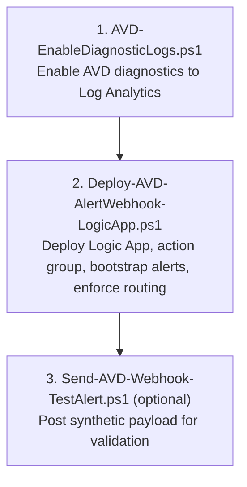
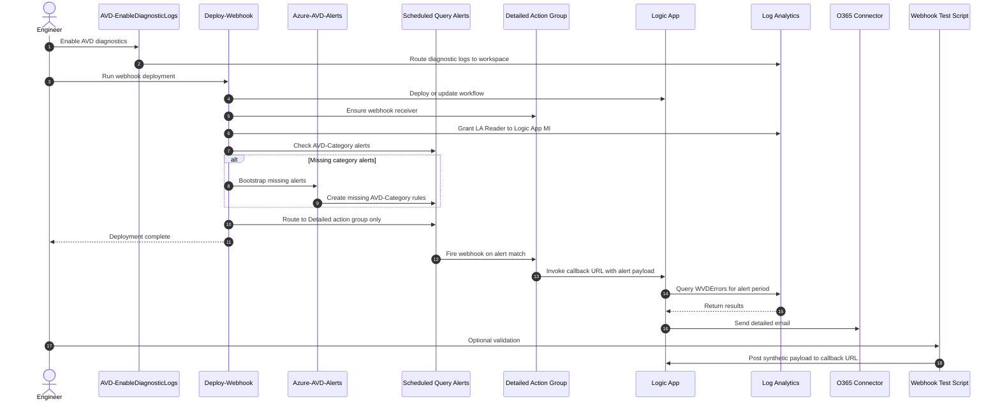

# Azure Virtual Desktop (AVD) Management Scripts

**Last Updated:** March 2026

PowerShell automation tools for configuring diagnostics, monitoring, and alerting for Azure Virtual Desktop environments.

## What This Repository Covers

- Enable and standardize AVD diagnostic settings to Log Analytics
- Deploy consolidated AVD category alerts in Azure Monitor
- Deploy rich webhook-based detailed notifications through a Logic App

## Run Order

1. First: `AVD-Diagnostics/AVD-EnableDiagnosticLogs.ps1`
2. Deploy alerts: `AVD-AzAlerts/Deploy-AVD-AlertWebhook-LogicApp.ps1`
3. Optional validation: `AVD-AzAlerts/Send-AVD-Webhook-TestAlert.ps1`

## Script Flow Diagram



## Execution Sequence



## Critical Prerequisites

- Azure CLI installed and authenticated (`az login`)
- Required Azure RBAC on target resource groups
- PowerShell 7 (`pwsh`) recommended for best compatibility and parallel processing

### Important: Diagnostics Must Be Enabled First

Run `AVD-Diagnostics/AVD-EnableDiagnosticLogs.ps1` before deploying alerts unless diagnostics are already enabled on AVD resources.

Without diagnostic logs in Log Analytics, alert queries do not have data to evaluate.

### Important: `WorkspaceName` (Log Analytics Workspace) Guidance

For `AVD-AzAlerts/Deploy-AVD-AlertWebhook-LogicApp.ps1`, `-WorkspaceName` is the Log Analytics workspace name used by alert queries.

If there is already an existing AVD Log Analytics workspace (including Nerdio-managed environments), reuse it.

- Set `-ResourceGroupName` to the workspace resource group
- Set `-WorkspaceName` to that existing workspace name

Do not create a new workspace unless needed.

## Quick Start

### 1) Enable AVD diagnostics first

```powershell
cd AVD-Diagnostics
pwsh -NoProfile -File .\AVD-EnableDiagnosticLogs.ps1 `
  -SubscriptionId "YOUR-SUBSCRIPTION-ID" `
  -WorkspaceName "YOUR-LAW-NAME"
```

### 2) Alerts and Webhook Deployment

#### Deploy Rich Alerts via Webhook + Logic App (Single Script)

This deploys webhook infrastructure, bootstraps missing `AVD-Category-*` alerts if needed, and applies detailed-only routing.

```powershell
cd ..\AVD-Alerts
pwsh -NoProfile -File .\Deploy-AVD-AlertWebhook-LogicApp.ps1 `
  -SubscriptionId "YOUR-SUBSCRIPTION-ID" `
  -ResourceGroupName "YOUR-ALERTS-RG" `
  -LogicAppName "AVD-alert-details" `
  -Location "eastus2" `
  -WorkspaceName "YOUR-LAW-NAME" `
  -WorkspaceResourceGroupName "YOUR-LAW-RG" `
  -SendFromEmail "alerts@contoso.com" `
  -SendToEmails @("avd-oncall@contoso.com", "avd-manager@contoso.com") `
  -Office365ConnectionName "avd-alerts-office365"
```

ATTENTION: Authorize `avd-alerts-office365` (or your chosen `-Office365ConnectionName`) in Azure Portal with valid mailbox credentials before expecting detailed emails.

## Current Alert Model

All alerts use webhook-based detailed routing through a Logic App. `Deploy-AVD-AlertWebhook-LogicApp.ps1` is the single deployment entry point, which bootstraps `AVD-Category-*` alerts and configures the webhook action group.

See `AVD-AzAlerts/README.md` for full script details, RBAC, category breakdown, and end-to-end examples.

## Documentation

- `AVD-Diagnostics/README.md`
- `AVD-AzAlerts/README.md`

## Related Resources

- Azure Virtual Desktop documentation: https://learn.microsoft.com/azure/virtual-desktop/
- Monitor AVD with Azure Monitor: https://learn.microsoft.com/azure/virtual-desktop/monitor-azure-virtual-desktop
- AVD Insights workbook: https://learn.microsoft.com/azure/virtual-desktop/insights

## License

See `LICENSE` for details.

## Disclaimer

THE SOFTWARE IS PROVIDED "AS IS", WITHOUT WARRANTY OF ANY KIND, EXPRESS OR IMPLIED.

These scripts are provided as-is under the MIT License. Always validate in a non-production environment before production rollout.
