# Azure Virtual Desktop — Diagnostics, Insights & Rich Email Alert Automation

**Last Updated:** March 2026

PowerShell automation for Azure Virtual Desktop that goes beyond standard Azure Monitor alert emails. These scripts deploy **rich, detailed email alerts** powered by Logic Apps that re-query Log Analytics at alert time — delivering operator-friendly HTML emails with affected host names, error codes, user names, and troubleshooting context that standard Azure Monitor notifications don't include.

**What it delivers:**

- **16 WVDErrors category alerts** — connection failures, authentication errors, session host health, FSLogix profile issues, network/gateway problems, bandwidth drops, round-trip latency, sign-in delays, and frame quality degradation
- **7 Insights performance alerts** — CPU saturation, memory pressure, disk latency/capacity, input delay, session quality (RTT, UDP), GPU encoding, session lifecycle, and FSLogix correlation
- **Diagnostic log enablement** — auto-discovers and configures all AVD resources in a subscription
- **Data Collection Rules** — 28 perf counters (CPU, memory, disk, network, GPU, AVD session quality) collected via Azure Monitor Agent

## Repository Structure

```text
AVD/
├── AVD-Diagnostics/           # Enable diagnostic logs on all AVD resources
├── AVD-AzAlerts/              # WVDErrors category alerts + Logic App email pipeline
├── AVD-SessionHostMonitoring/ # Perf counter DCR + Insights category alerts + Logic App
│   ├── AVD-Insights-Alerts/   # 7 category alert rules + Logic App email pipeline
│   └── AVD-Insights-Enable-PerfMetrics-Monitoring.ps1  # DCR + AMA setup
└── README.md
```

## Script Reference

| # | Script | Purpose | What It Does | Quick Start |
| -- | ------ | ------- | ------------ | ----------- |
| 1 | `AVD-Enable-Diagnostic-Logs.ps1` | Enable AVD diagnostic logs | Discovers all host pools, app groups, and workspaces in a subscription and configures `allLogs` diagnostic settings to route telemetry to Log Analytics. Exports a CSV status report. | `.\AVD-Diagnostics\AVD-Enable-Diagnostic-Logs.ps1 -SubscriptionId "YOUR-SUB-ID" -WorkspaceName "YOUR-LAW" -WorkspaceResourceGroupName "YOUR-LAW-RG"` |
| 2 | `AVD-RBAC-Precheck.ps1` | Validate RBAC before deployment | Evaluates whether the signed-in user (or a specified principal) has the required Azure RBAC actions across resource group, workspace, and subscription scopes. Outputs a permission report table and optional CSV. Read-only — no changes made. | `.\AVD-AzAlerts\AVD-RBAC-Precheck.ps1 -SubscriptionId "YOUR-SUB-ID" -ResourceGroupName "YOUR-RG" -WorkspaceName "YOUR-LAW" -WorkspaceResourceGroupName "YOUR-LAW-RG"` |
| 3 | `AVD-Deploy-Alert-LogicApp.ps1` | Deploy WVDErrors alerts + email Logic App | **Primary entry point for WVDErrors alerting.** Creates/updates the Logic App, Office 365 API connection, webhook action group, assigns Log Analytics Reader to the Logic App managed identity, and bootstraps all 16 `AVD-Category-*` scheduled query alerts. Single command — no other scripts needed. | `.\AVD-AzAlerts\AVD-Deploy-Alert-LogicApp.ps1 -SubscriptionId "YOUR-SUB-ID" -ResourceGroupName "YOUR-RG" -LogicAppName "AVD-alert-details" -Location "eastus2" -WorkspaceName "YOUR-LAW" -WorkspaceResourceGroupName "YOUR-LAW-RG" -SendFromEmail "alerts@contoso.com" -SendToEmails "team@contoso.com"` |
| 4 | `AVD-Category-Alerts.ps1` | Create AVD category alert rules | Creates and maintains `AVD-Category-*` scheduled query alerts and the webhook action group. Called automatically by script #3 — run directly only when you need standalone alert creation without the Logic App pipeline. | `.\AVD-AzAlerts\AVD-Category-Alerts.ps1 -DetailedResultsWebhookUrl "https://your-logicapp-callback-url"` |
| 5 | `AVD-Webhook-TestAlert.ps1` | Validate webhook end-to-end | Posts a synthetic Azure Monitor alert payload to a Logic App callback URL. Use after deployment to verify emails arrive. | `.\AVD-AzAlerts\AVD-Webhook-TestAlert.ps1 -ResourceGroup "YOUR-RG" -LogicAppName "AVD-alert-details"` |
| 6 | `AVD-Insights-Enable-PerfMetrics-Monitoring.ps1` | Deploy DCR + AMA for perf counters | Creates a Data Collection Rule collecting 28 perf counters into `InsightsMetrics` and `Perf` tables, auto-discovers all AVD host pools, provides an interactive menu to associate the DCR with session hosts, and installs AMA where missing. | `.\AVD-SessionHostMonitoring\AVD-Insights-Enable-PerfMetrics-Monitoring.ps1 -SubscriptionId "YOUR-SUB-ID" -LawRG "YOUR-LAW-RG" -LawName "YOUR-LAW" -DcrRG "YOUR-DCR-RG" -DcrName "AVD-SessionHost-DCR" -Location "eastus2"` |
| 7 | `AVD-Insights-Alerts-Precheck.ps1` | Validate Insights prerequisites | Checks RBAC permissions, Azure CLI extensions, LAW connectivity, and verifies that Perf counter data is flowing to the workspace. Read-only — no changes made. | `.\AVD-SessionHostMonitoring\AVD-Insights-Alerts\AVD-Insights-Alerts-Precheck.ps1 -SubscriptionId "YOUR-SUB-ID" -ResourceGroupName "YOUR-RG" -WorkspaceName "YOUR-LAW"` |
| 8 | `AVD-Insights-Deploy-LogicApp.ps1` | Deploy Insights alerts + email Logic App | **Primary entry point for Insights alerting.** Creates/updates the Logic App, Office 365 API connection, webhook action group, assigns Log Analytics Reader to the Logic App managed identity, and bootstraps all 7 `AVD-Insights-Category-*` alerts. Single command — no other scripts needed. | `.\AVD-SessionHostMonitoring\AVD-Insights-Alerts\AVD-Insights-Deploy-LogicApp.ps1 -SubscriptionId "YOUR-SUB-ID" -ResourceGroupName "YOUR-RG" -LogicAppName "AVD-Insights-Alert-Email" -Location "eastus2" -WorkspaceName "YOUR-LAW" -WorkspaceResourceGroupName "YOUR-LAW-RG" -SendFromEmail "alerts@contoso.com" -SendToEmail "team@contoso.com"` |
| 9 | `AVD-Insights-Category-Alerts.ps1` | Create Insights alert rules only | Reads alert definitions from `alerts-config.insights.json`, loads KQL query files, and creates Azure Monitor scheduled query rules. Called automatically by script #8 — run directly only when you need standalone alert creation without the Logic App pipeline. | `.\AVD-SessionHostMonitoring\AVD-Insights-Alerts\AVD-Insights-Category-Alerts.ps1 -ResourceGroup "YOUR-RG" -WorkspaceName "YOUR-LAW" -Location "eastus2"` |

## What Do You Want to Monitor?

```mermaid
flowchart TD
    START{"What do you want\nto monitor?"}

    START -->|"AVD connection errors\n(WVDErrors alerts)"| PATH_A
    START -->|"Session host performance\n(CPU, memory, disk, GPU)"| PATH_B
    START -->|"Both"| PATH_C

    subgraph PATH_A ["WVDErrors Alert Emails"]
        A1["1. Enable Diagnostic Settings\nAVD-Enable-Diagnostic-Logs.ps1"]
        A2["2. Deploy Webhook Logic App\nAVD-Deploy-Alert-LogicApp.ps1"]
        A3["3. Authorize Office 365 connection\nin Azure Portal"]
        A4["4. (Optional) Send test alert\nAVD-Webhook-TestAlert.ps1"]
        A1 --> A2 --> A3 --> A4
    end

    subgraph PATH_B ["Insights Performance Alert Emails"]
        B1["1. Enable Diagnostic Settings\nAVD-Enable-Diagnostic-Logs.ps1"]
        B2["2. Deploy DCR + AMA\nAVD-Insights-Enable-PerfMetrics-Monitoring.ps1"]
        B3["3. Deploy Insights Logic App\nAVD-Insights-Deploy-LogicApp.ps1"]
        B4["4. Authorize Office 365 connection\nin Azure Portal"]
        B5["5. (Optional) Send test alert\nAVD-Webhook-TestAlert.ps1"]
        B1 --> B2 --> B3 --> B4 --> B5
    end

    subgraph PATH_C ["Both: Full Monitoring Stack"]
        C1["1. Enable Diagnostic Settings\nAVD-Enable-Diagnostic-Logs.ps1"]
        C2["2a. Deploy Webhook Logic App\nAVD-Deploy-Alert-LogicApp.ps1"]
        C3["2b. Deploy DCR + AMA\nAVD-Insights-Enable-PerfMetrics-Monitoring.ps1"]
        C4["3. Deploy Insights Logic App\nAVD-Insights-Deploy-LogicApp.ps1"]
        C5["4. Authorize both Office 365\nconnections in Azure Portal"]
        C6["5. (Optional) Send test alerts\nAVD-Webhook-TestAlert.ps1"]
        C1 --> C2
        C1 --> C3
        C3 --> C4
        C2 --> C5
        C4 --> C5
        C5 --> C6
    end
```



---

## Quick Start: AVD-AzAlerts (WVDErrors)

Deploys 16 consolidated WVDErrors category alerts + a Logic App that sends detailed email notifications with per-alert KQL re-queries.

### AVD-AzAlerts Requirements (auto-installed by the script)

- **RBAC**: Owner or Contributor on the target resource group, **or** Monitoring Contributor + Log Analytics Reader
- A Log Analytics workspace already receiving AVD diagnostic logs
- An Office 365 mailbox for sending alert emails

### Step 1: Enable diagnostics (if not already done)

```powershell
.\AVD-Diagnostics\AVD-Enable-Diagnostic-Logs.ps1 `
  -SubscriptionId "YOUR-SUBSCRIPTION-ID" `
  -WorkspaceName "YOUR-LAW-NAME" `
  -WorkspaceResourceGroupName "YOUR-LAW-RG"
```

### Step 2: Deploy alerts + Logic App (single command)

```powershell
.\AVD-AzAlerts\AVD-Deploy-Alert-LogicApp.ps1 `
  -SubscriptionId "YOUR-SUBSCRIPTION-ID" `
  -ResourceGroupName "YOUR-ALERTS-RG" `
  -LogicAppName "AVD-alert-details" `
  -Location "eastus2" `
  -WorkspaceName "YOUR-LAW-NAME" `
  -WorkspaceResourceGroupName "YOUR-LAW-RG" `
  -SendFromEmail "alerts@contoso.com" `
  -SendToEmails "avd-oncall@contoso.com","noc@contoso.com" `
  -Office365ConnectionName "avd-alerts-office365"
```

This single command will:

1. Create/update the Office 365 API connection
2. Deploy the Logic App with system-assigned managed identity
3. Assign Log Analytics Reader to the Logic App identity
4. Create the webhook action group
5. Bootstrap any missing `AVD-Category-*` alert rules
6. Route all alerts to the detailed webhook action group

> **Note:** Authorize the Office 365 API connection in Azure Portal with valid mailbox credentials before emails will flow.

### Step 3 (Optional): Validate

```powershell
.\AVD-AzAlerts\AVD-Webhook-TestAlert.ps1 -WebhookUrl "<callback-url-from-step-2>"
```

See [AVD-AzAlerts/README.md](AVD-AzAlerts/README.md) for full details, RBAC breakdown, and alert categories.

---

## Quick Start: AVD-SessionHostMonitoring (Insights)

Deploys a Data Collection Rule with 28 perf counters, installs AMA on session hosts, then deploys 7 Insights category alerts + a Logic App for detailed email notifications.

### Insights Requirements

- Azure CLI installed and authenticated (`az login`)
- Azure CLI extensions: `scheduled-query`, `desktopvirtualization` (auto-installed by scripts)
- **RBAC for DCR setup**: Monitoring Contributor on the DCR resource group and Log Analytics workspace + Desktop Virtualization Reader on the subscription
- **RBAC for alerts**: Owner or Contributor on the target resource group, **or** Monitoring Contributor + Log Analytics Reader
- A Log Analytics workspace
- AVD Diagnostics enabled (for WVDCheckpoints, WVDAgentHealthStatus tables used by some alert queries)
- An Office 365 mailbox for sending alert emails

### Step 1: Deploy DCR + associate session hosts

```powershell
.\AVD-SessionHostMonitoring\AVD-Insights-Enable-PerfMetrics-Monitoring.ps1 `
  -SubscriptionId "YOUR-SUBSCRIPTION-ID" `
  -LawRG "YOUR-LAW-RG" `
  -LawName "YOUR-LAW-NAME" `
  -DcrRG "YOUR-DCR-RG" `
  -DcrName "AVD-SessionHost-DCR" `
  -Location "eastus2"
```

The script will:

1. Create a DCR collecting 28 perf counters into both `InsightsMetrics` and `Perf` tables
2. Discover all AVD host pools in the subscription
3. Present an interactive menu to associate DCR with session hosts
4. Install Azure Monitor Agent (AMA) on VMs where missing

> **Tip:** Add `-WhatIf` to preview without making changes. Add `-Verbose` for detailed diagnostic output.

### Step 2: Deploy Insights alerts + Logic App (single command)

```powershell
.\AVD-SessionHostMonitoring\AVD-Insights-Alerts\AVD-Insights-Deploy-LogicApp.ps1 `
  -SubscriptionId "YOUR-SUBSCRIPTION-ID" `
  -ResourceGroupName "YOUR-ALERTS-RG" `
  -LogicAppName "AVD-Insights-Alert-Email" `
  -Location "eastus2" `
  -WorkspaceName "YOUR-LAW-NAME" `
  -WorkspaceResourceGroupName "YOUR-LAW-RG" `
  -SendFromEmail "alerts@contoso.com" `
  -SendToEmail "avd-oncall@contoso.com"
```

This single command will:

1. Create/update the Office 365 API connection
2. Deploy the Logic App with system-assigned managed identity
3. Assign Log Analytics Reader to the Logic App identity
4. Create the webhook action group
5. Bootstrap any missing `AVD-Insights-Category-*` alert rules (calls `AVD-Insights-Category-Alerts.ps1` internally)
6. Route all Insights alerts to the detailed webhook action group

> **Note:** Wait 5-15 minutes after Step 1 for perf counter data to appear in Log Analytics before alert queries can evaluate.

See [AVD-SessionHostMonitoring/AVD-Insights-Alerts/README.md](AVD-SessionHostMonitoring/AVD-Insights-Alerts/README.md) for alert categories, threshold tuning, and advanced options.

---

## Important Notes

### `WorkspaceName` Guidance

If there is already an existing AVD Log Analytics workspace (including Nerdio-managed environments), reuse it. Do not create a new workspace unless needed.

### Diagnostics Must Be Enabled First

Run `AVD-Diagnostics/AVD-Enable-Diagnostic-Logs.ps1` before deploying alerts unless diagnostics are already enabled. Without diagnostic logs in Log Analytics, alert queries do not have data to evaluate.

### Office 365 Connection Authorization

Both Logic App scripts auto-create the Office 365 API connection, but it must be manually authorized in Azure Portal with valid mailbox credentials before emails will flow.

## Documentation

| Area | Link |
| ------ | ------ |
| AVD Diagnostics | [AVD-Diagnostics/README.md](AVD-Diagnostics/README.md) |
| WVDErrors Alerts | [AVD-AzAlerts/README.md](AVD-AzAlerts/README.md) |
| Alert Matrix (WVDErrors) | [AVD-AzAlerts/AVD-Alerts-Matrix.md](AVD-AzAlerts/AVD-Alerts-Matrix.md) |
| Runbook (WVDErrors) | [AVD-AzAlerts/AVD-Alerts-Runbook.md](AVD-AzAlerts/AVD-Alerts-Runbook.md) |
| DCR / AMA Setup | [AVD-SessionHostMonitoring/README.md](AVD-SessionHostMonitoring/README.md) |
| Insights Alerts | [AVD-SessionHostMonitoring/AVD-Insights-Alerts/README.md](AVD-SessionHostMonitoring/AVD-Insights-Alerts/README.md) |
| Alert Matrix (Insights) | [AVD-SessionHostMonitoring/AVD-Insights-Alerts/Insights-Alert-Matrix.md](AVD-SessionHostMonitoring/AVD-Insights-Alerts/Insights-Alert-Matrix.md) |
| Runbook (Insights) | [AVD-SessionHostMonitoring/AVD-Insights-Alerts/Insights-Runbook.md](AVD-SessionHostMonitoring/AVD-Insights-Alerts/Insights-Runbook.md) |

## Related Resources

- [Azure Virtual Desktop documentation](https://learn.microsoft.com/azure/virtual-desktop/)
- [Monitor AVD with Azure Monitor](https://learn.microsoft.com/azure/virtual-desktop/monitor-azure-virtual-desktop)
- [AVD Insights workbook](https://learn.microsoft.com/azure/virtual-desktop/insights)

## License

See `LICENSE` for details.

## Disclaimer

THE SOFTWARE IS PROVIDED "AS IS", WITHOUT WARRANTY OF ANY KIND, EXPRESS OR IMPLIED.

These scripts are provided as-is under the MIT License. Always validate in a non-production environment before production rollout.
