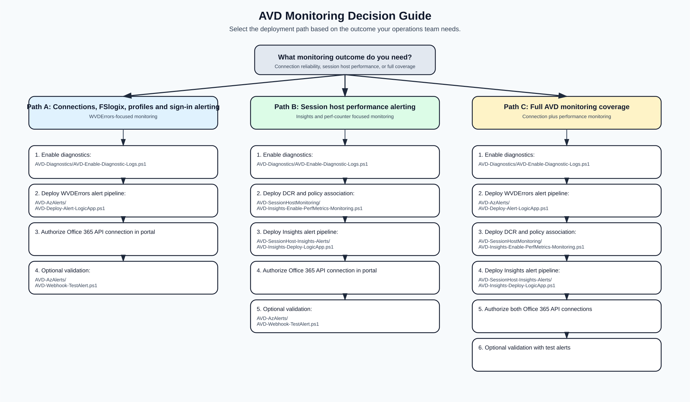

# Azure Virtual Desktop - Diagnostics, Insights, and Rich Email Alert Automation

<!-- markdownlint-configure-file {"MD033": false} -->

**Last Updated:** March 2026

PowerShell automation for Azure Virtual Desktop that goes beyond standard Azure Monitor alert emails. These scripts deploy rich, detailed email alerts powered by Logic Apps that re-query Log Analytics at alert time, delivering operator-friendly HTML emails with affected host names, error codes, user names, and troubleshooting context.

**What it delivers:**

- **16 WVDErrors category alerts** - connection failures, authentication errors, session host health, FSLogix profile issues, network and gateway problems, bandwidth drops, round-trip latency, sign-in delays, and frame quality degradation.
- **7 Insights performance alerts** - CPU saturation, memory pressure, disk latency and capacity, input delay, session quality (RTT, UDP), GPU encoding, session lifecycle, and FSLogix correlation.
- **Diagnostic log enablement** - auto-discovers and configures all AVD resources in a subscription.
- **Data Collection Rules** - 28 perf counters (CPU, memory, disk, network, GPU, session quality) collected via Azure Monitor Agent.

## Repository Structure

```text
AVD/
|- AVD-Diagnostics/             # Enable diagnostic logs on AVD resources
|- AVD-AzAlerts/                # WVDErrors category alerts + Logic App email pipeline
|- AVD-SessionHostMonitoring/   # DCR and session-host monitoring setup
|- AVD-SessionHost-Insights-Alerts/ # Insights category alert rules + Logic App pipeline
|- assets/
|  |- avd-monitoring-decision-guide.svg
|- README.md
```

## AVD Projects at a Glance

| Project Folder | Purpose | What It Is Used For | How It Helps Customer AVD Deployments | Folder Link |
| --- | --- | --- | --- | --- |
| `AVD-Diagnostics` | Enable diagnostic settings across host pools, app groups, and workspaces. | Foundation step before alerting, troubleshooting, and audit workflows. | Ensures consistent telemetry coverage in Log Analytics without manual per-resource setup. | [AVD-Diagnostics](AVD-Diagnostics/) |
| `AVD-AzAlerts` | Deploy WVDErrors-based category alerts and Logic App detailed-email pipeline. | Monitoring connection failures, auth and policy issues, session host health, network and gateway issues, and FSLogix profile failures. | Delivers actionable alert emails with host names, error codes, and context so operations teams can triage quickly. | [AVD-AzAlerts](AVD-AzAlerts/) |
| `AVD-SessionHostMonitoring` | Create or update DCR-based performance collection and optional AMA or DCR policy association. | Enabling Insights telemetry for session host performance counters at scale. | Standardizes data collection for capacity planning, baselining, and proactive operations. | [AVD-SessionHostMonitoring](AVD-SessionHostMonitoring/) |
| `AVD-SessionHost-Insights-Alerts` | Deploy consolidated Insights alert categories with Logic App detailed-email workflow. | Monitoring host performance degradation, session lifecycle issues, disk pressure, correlated FSLogix signals, event-based FSLogix profile errors, and GPU behavior. | Provides context-rich performance alerts with breached counters and affected hosts to reduce time to mitigation. | [AVD-SessionHost-Insights-Alerts](AVD-SessionHost-Insights-Alerts/) |

## Monitoring Decision Guide

Use this diagram to choose the correct AVD deployment path based on the monitoring outcome you need.



[Open full-size SVG](assets/avd-monitoring-decision-guide.svg)

Use the links in the Documentation section below for full deployment commands and runbooks.

## Important Notes

### <span style="color:#b00020;">WorkspaceName Guidance</span>

If there is already an existing AVD Log Analytics workspace (including Nerdio-managed environments), reuse it. Do not create a new workspace unless needed.

### <span style="color:#b00020;">Diagnostics Must Be Enabled First</span>

Run `AVD-Diagnostics/AVD-Enable-Diagnostic-Logs.ps1` before deploying alerts unless AVD diagnostics are already enabled. Without diagnostic logs in Log Analytics, AVD alert queries do not have data to evaluate.
Run `AVD-SessionHostMonitoring/AVD-Insights-Enable-PerfMetrics-Monitoring.ps1` to enable Insights telemetry for CPU, memory, disk, IOPS, network, GPU, and session quality counters across session hosts.

### <span style="color:#b00020;">Office 365 Connection Authorization</span>

Both Logic App deployment scripts auto-create the Office 365 API connection, but it must be manually authorized in Azure Portal with valid mailbox credentials before emails will flow.

## Documentation

| Area | Link |
| --- | --- |
| AVD Diagnostics | [AVD-Diagnostics/README.md](AVD-Diagnostics/README.md) |
| WVDErrors Alerts | [AVD-AzAlerts/README.md](AVD-AzAlerts/README.md) |
| Alert Matrix (WVDErrors) | [AVD-AzAlerts/AVD-Alerts-Matrix.md](AVD-AzAlerts/AVD-Alerts-Matrix.md) |
| Runbook (WVDErrors) | [AVD-AzAlerts/AVD-Alerts-Runbook.md](AVD-AzAlerts/AVD-Alerts-Runbook.md) |
| DCR and AMA Setup | [AVD-SessionHostMonitoring/README.md](AVD-SessionHostMonitoring/README.md) |
| Insights Alerts | [AVD-SessionHost-Insights-Alerts/README.md](AVD-SessionHost-Insights-Alerts/README.md) |
| Alert Matrix (Insights) | [AVD-SessionHost-Insights-Alerts/Insights-Alert-Matrix.md](AVD-SessionHost-Insights-Alerts/Insights-Alert-Matrix.md) |
| Runbook (Insights) | [AVD-SessionHost-Insights-Alerts/Insights-Runbook.md](AVD-SessionHost-Insights-Alerts/Insights-Runbook.md) |
| Monitoring Decision Diagram | [assets/avd-monitoring-decision-guide.svg](assets/avd-monitoring-decision-guide.svg) |
| Session Host Insights Project Folder | [AVD-SessionHost-Insights-Alerts](AVD-SessionHost-Insights-Alerts/) |

## Related Resources

- [Azure Virtual Desktop documentation](https://learn.microsoft.com/azure/virtual-desktop/)
- [Monitor AVD with Azure Monitor](https://learn.microsoft.com/azure/virtual-desktop/monitor-azure-virtual-desktop)
- [AVD Insights workbook](https://learn.microsoft.com/azure/virtual-desktop/insights)

## License

See `LICENSE` for details.

## Disclaimer

THE SOFTWARE IS PROVIDED "AS IS", WITHOUT WARRANTY OF ANY KIND, EXPRESS OR IMPLIED.

These scripts are provided as-is under the MIT License. Always validate in a non-production environment before production rollout.
